# lab2web
## Belajar dasar HTML

### 1. Membuat dokumen HTML
Buatlah dokumen HTML seperti berikut
ini adalah tampilanya
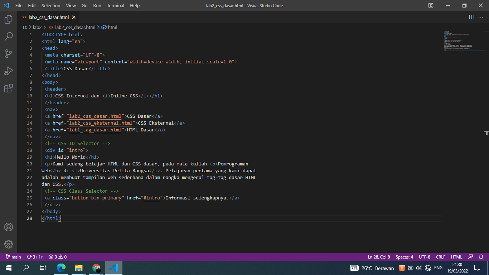

Selanjutnya buka pada brwoser untuk melihat hasilnya.
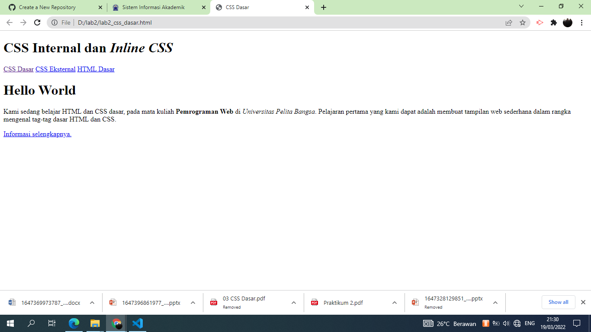

### 2. Mendeklarasikan CSS Internal
Kemudian tambahkan deklarasi CSS internal seperti berikut pada bagian head dokumen
ini adalah tampilanya
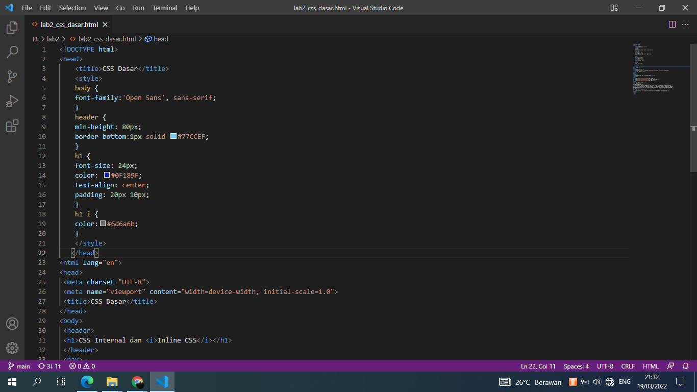

Selanjutnya buka pada brwoser untuk melihat hasilnya.
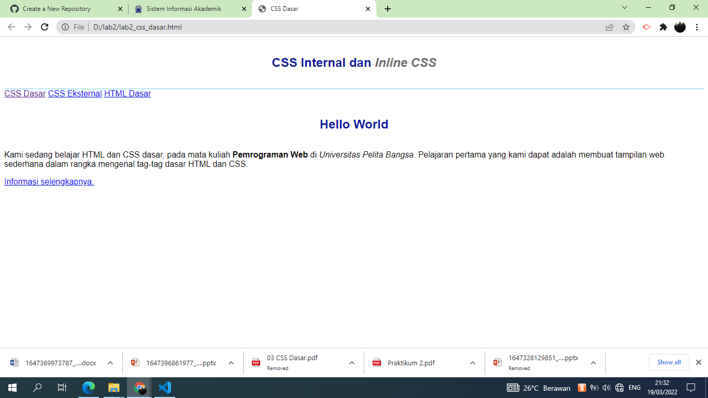

### 3. Menambahkan Inline CSS
Kemudian tambahkan deklarasi inline CSS pada tag '
' seperti berikut
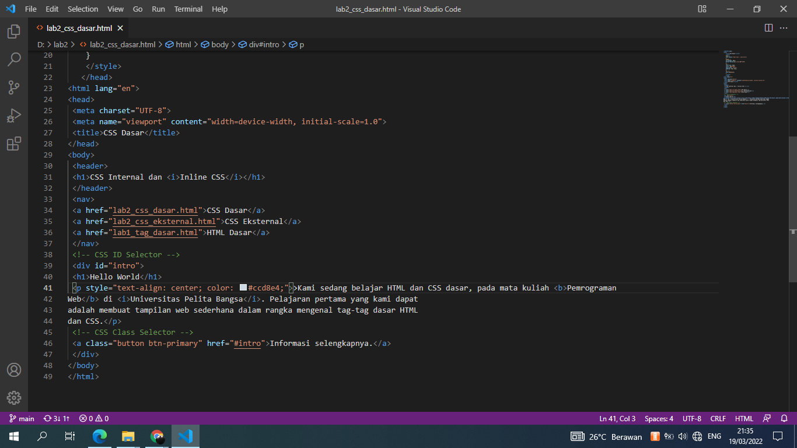

Simpan kembali dan refresh kembali browser untuk melihat perubahannya.
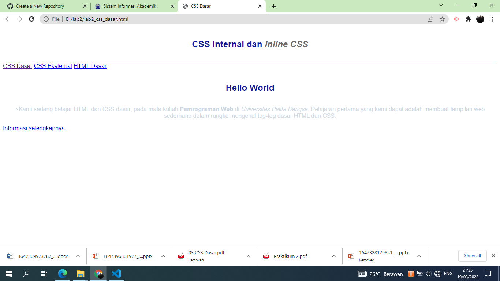

### 4. Membuat CSS Eksternal
Buatlah file baru dengan nama style_eksternal.css kemudian buatlah deklarasi CSS seperti berikut.
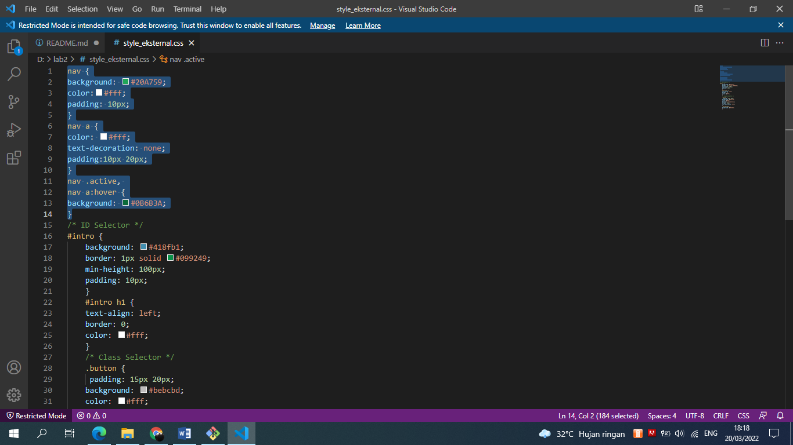

Kemudian tambahkan tag '<link>' untuk merujuk file css yang sudah dibuat pada bagian '<head>'
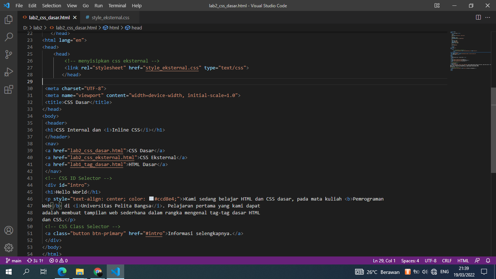

Selanjutnya refresh kembali browser untuk melihat perubahannya.
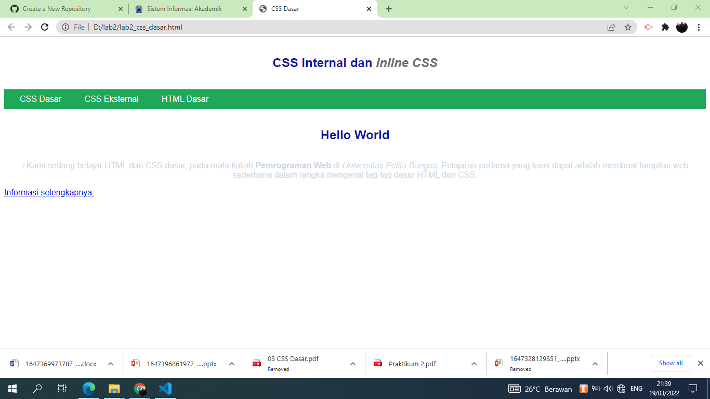

### 5. Menambahkan CSS Selector
Selanjutnya menambahkan CSS Selector menggunakan ID dan Class Selector. Pada file 
style_eksternal.css, tambahkan kode berikut.
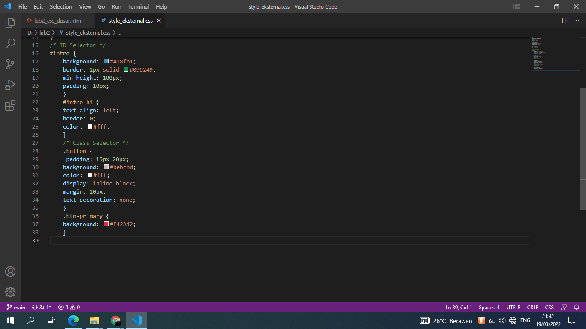

Kemudian simpan kembali dan refresh browser untuk melihat perubahannya
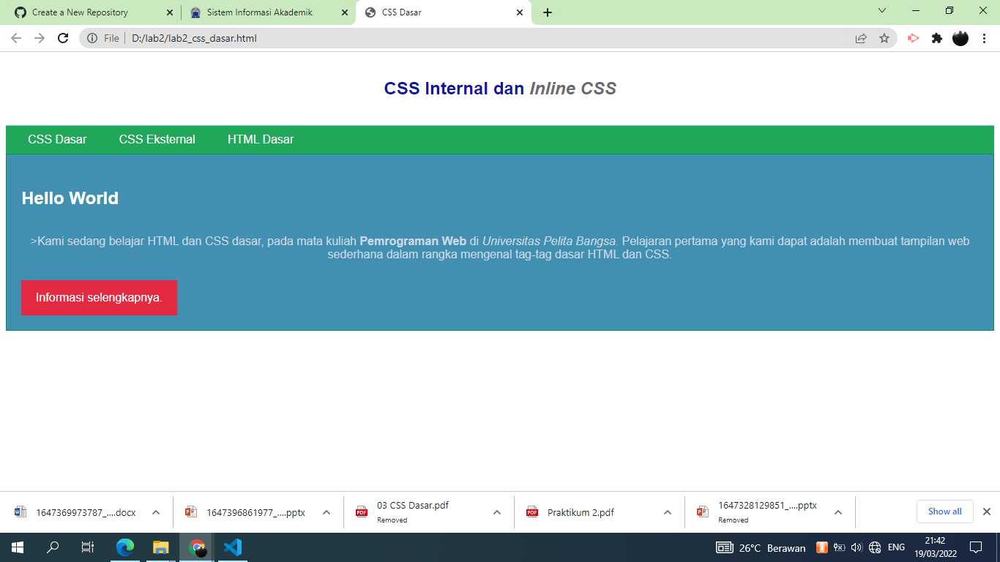

## TERIMA KASIH

